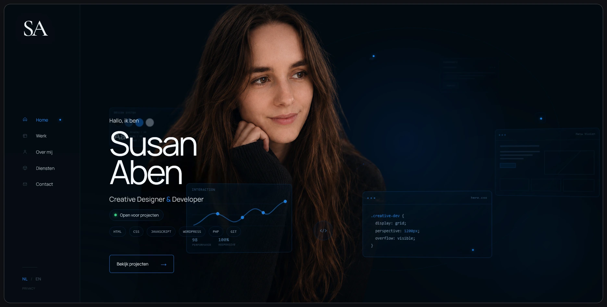

# Meta Vision - Susan Aben Portfolio

A custom WordPress portfolio designed and developed from scratch as a creative frontend project.

Meta Vision combines visual design, frontend development, interaction and motion in one dark editorial interface. The goal was to build a portfolio that does not just show projects, but also reflects the way I like to design and develop digital experiences.



## Technologies represented in my work

- WordPress
- PHP
- CSS
- JavaScript
- React
- TypeScript
- Tailwind CSS
- Laravel
- MySQL
- Git

## Built with

- WordPress
- PHP
- CSS
- Vanilla JavaScript
- TranslatePress
- WordPress AJAX
- `wp_mail()`

No page builder or frontend framework is used.

## What I focused on

### Creative frontend

The portfolio uses custom layouts, motion and interface-inspired details rather than a standard portfolio template.

This includes:

- an interactive Meta Vision homepage
- animated project carousel
- desktop and mobile project previews
- responsive case-study layouts
- custom page transitions
- subtle pointer interactions
- reduced-motion alternatives

### Responsive design

The interface was designed for desktop, tablet and mobile rather than simply scaling down the desktop layout.

Layouts and interactions were tested at multiple viewport sizes, including 360px, 390px, 430px, 768px and 1024px.

### Accessibility

Accessibility was included as part of the final QA process.

Examples include:

- keyboard navigation
- visible focus states
- semantic headings
- accessible form labels
- screen-reader feedback
- focus management for the mobile menu
- reduced-motion support
- accessible carousel controls
- meaningful image alternative text

### Performance

The project went through a dedicated performance cleanup.

Images were converted and optimized for the web, unused assets and legacy CSS were removed, and layout shifts and loading priorities were reviewed.

During local QA, Lighthouse reached:

| Category | Score |
| --- | ---: |
| Performance | 99 |
| Accessibility | 100 |
| Best Practices | 100 |
| SEO | 100 |

Lighthouse results can vary depending on environment and hosting.

## Project highlights

- Fully custom WordPress theme
- Multi-page portfolio
- Interactive project showcase
- Reusable case-study system
- Native WordPress AJAX contact form
- Responsive sidebar and mobile navigation
- Custom 404 page
- Custom privacy page
- Structured metadata and Open Graph output
- Bilingual Dutch / English setup
- No required frontend build process

## Selected case studies

- Cartnip — WooCommerce storefront concept
- KLABEN Autos — automotive UX/UI concept
- NoordgroeiT — community WordPress platform
- EHBO Petrus Donders — website redesign
- EventFlow — React and TypeScript event discovery app
- Clientboard — Laravel client and project management dashboard

## Theme structure

```text
assets/
├── css/
│   └── main.css
├── images/
└── js/
    └── main.js

404.php
footer.php
front-page.php
functions.php
header.php
index.php
page-cartnip.php
page-contact.php
page-diensten.php
page-ehbo-petrus-donders.php
page-meta-vision.php
page-noordgroeit.php
page-over-mij.php
page-privacy.php
page-werk.php
style.css   
